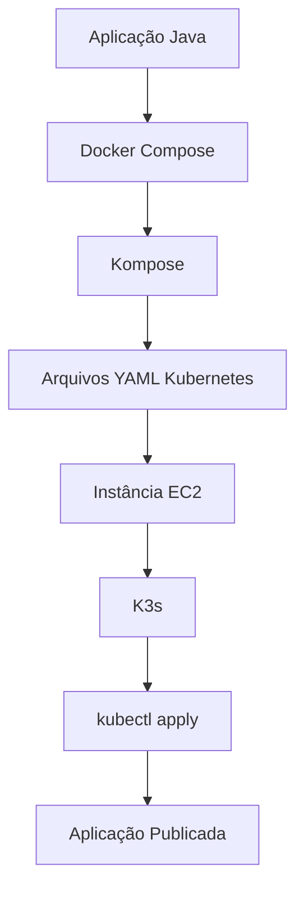

# ☁️ Deploy Kubernetes na AWS Academy utilizando EC2 e K3s


## Objetivo

Neste tutorial será realizado o deploy de uma aplicação Kubernetes em uma instância EC2 da AWS Academy.

Como o ambiente AWS Academy possui restrições para utilização do Amazon EKS, será utilizada uma instância EC2 executando o K3s, uma distribuição leve do Kubernetes.

Ao final deste tutorial a aplicação estará acessível através do IP público da instância.


> **Observação:** Em ambientes de produção normalmente utilizaríamos o Amazon EKS (Elastic Kubernetes Service).

---

## Sumário

* [Arquitetura](#arquitetura)
* [Pré-requisitos](#pré-requisitos)
* [1. Criando a instância EC2](#1-criando-a-instância-ec2)
* [2. Conectando à instância](#2-conectando-à-instância)
* [3. Atualizando o sistema](#3-atualizando-o-sistema)
* [4. Instalando o Kubernetes (K3s)](#4-instalando-o-kubernetes-k3s)
* [5. Gerando os arquivos Kubernetes](#5-gerando-os-arquivos-kubernetes)
* [6. Transferindo os arquivos para a EC2](#6-transferindo-os-arquivos-para-a-ec2)
* [7. Realizando o deploy](#7-realizando-o-deploy)
* [8. Configurando acesso externo](#8-configurando-acesso-externo)
* [9. Testando a aplicação](#9-testando-a-aplicação)
* [10. Escalando a aplicação](#10-escalando-a-aplicação)
* [11. Removendo os recursos](#11-removendo-os-recursos)
* [Comandos úteis](#comandos-úteis)
* [Conclusão](#conclusão)

---

## Arquitetura



---

## Pré-requisitos

* Conta AWS Academy ativa
* Docker instalado
* Docker Compose instalado
* Kompose instalado
* Projeto convertido para Kubernetes utilizando Kompose
* Cliente SSH
* Aplicação previamente testada localmente

---

## 1. Criando a instância EC2

Acesse o console da AWS e navegue até:

```text
EC2 → Instances → Launch Instance
```

Utilize as seguintes configurações:

| Configuração        | Valor                   |
| ------------------- | ----------------------- |
| Nome                | k8s-lab                 |
| Sistema Operacional | Ubuntu Server 26.04 LTS |
| Tipo                | t2.medium               |
| Armazenamento       | 20 GB                   |

Sempre crie uma nova chave SSH, pois a disponibilizada pela AWS Academy não está disponível para download.

### Configuração do Security Group

Libere as seguintes portas:

| Porta       | Protocolo | Finalidade |
| ----------- | --------- | ---------- |
| 22          | TCP       | SSH        |
| 8080        | TCP       | Aplicação  |
| 30000-32767 | TCP       | NodePort   |

Utilizando as configurações padrão da AWS Academy, as portas geralmente já estão abertas.
Após a criação da instância, anote o endereço IP público.

---

## 2. Conectando à instância

No Linux ou MacOS:

```bash
chmod 400 chave.pem

ssh -i chave.pem ubuntu@IP_PUBLICO
```

Exemplo:

```bash
ssh -i awsacademy.pem ubuntu@54.123.45.67
```

---

## 3. Atualizando o sistema

Execute:

```bash
sudo apt update

sudo apt upgrade -y
```

---

## 4. Instalando o Kubernetes (K3s)

Instale o K3s:

```bash
curl -sfL https://get.k3s.io | sh -
```

Verifique a instalação:

```bash
sudo kubectl get nodes
```

Resultado esperado:

```text
NAME      STATUS   ROLES                  AGE
ubuntu    Ready    control-plane,master
```

---

## 5. Gerando os arquivos Kubernetes

No computador local execute:

```bash
kompose convert
```

Serão gerados arquivos semelhantes aos seguintes:

```text
app-deployment.yaml
app-service.yaml

mysql-deployment.yaml
mysql-service.yaml
mysql-persistentvolumeclaim.yaml
```

---

## 6. Transferindo os arquivos para a EC2

No computador local:

```bash
scp -i chave.pem *.yaml ubuntu@IP_PUBLICO:/home/ubuntu
```

Exemplo:

```bash
scp -i awsacademy.pem *.yaml ubuntu@54.123.45.67:/home/ubuntu
```

---

## 7. Realizando o deploy

Na instância EC2 execute:

```bash
kubectl apply -f .
```

Verifique os recursos criados:

```bash
kubectl get deployments

kubectl get pods

kubectl get services
```

Aguarde até que todos os pods estejam no estado **Running**.

---

## 8. Configurando acesso externo

Edite o arquivo de serviço da aplicação:

```bash
nano app-service.yaml
```

Configure o serviço para utilizar NodePort:

```yaml
spec:
  type: NodePort
```

Exemplo:

```yaml
ports:
  - port: 8080
    targetPort: 8080
    nodePort: 30080
```

Aplique novamente a configuração:

```bash
kubectl apply -f app-service.yaml
```

Verifique:

```bash
kubectl get svc
```

---

## 9. Testando a aplicação

Acesse a aplicação pelo navegador:

```text
http://IP_PUBLICO:30080
```

Exemplo:

```text
http://54.123.45.67:30080
```

Se tudo estiver correto a aplicação será exibida.

---

## 10. Escalando a aplicação

Visualize os pods existentes:

```bash
kubectl get pods
```

Aumente a quantidade de réplicas:

```bash
kubectl scale deployment app --replicas=3
```

Verifique novamente:

```bash
kubectl get pods
```

Observe que o Kubernetes criará automaticamente novas instâncias da aplicação.

---

## 11. Removendo os recursos

Para remover todos os objetos criados:

```bash
kubectl delete -f .
```

---

## Comandos úteis

### Listar pods

```bash
kubectl get pods
```

### Listar serviços

```bash
kubectl get svc
```

### Visualizar logs

```bash
kubectl logs NOME_DO_POD
```

### Descrever um pod

```bash
kubectl describe pod NOME_DO_POD
```

### Visualizar nós

```bash
kubectl get nodes
```

---

## Próximos Passos

Após concluir este laboratório, será possível testar sua aplicação na nuvem.
Para isso, siga os seguintes passos:

1. Configurar o Metrics Server;
2. Configurar o Horizontal Pod Autoscaler (HPA);
3. Gerar carga para sua aplicação suficiente para testar a elasticidade;
4. Monitorar o consumo de CPU/Memória;
5. Observar do escalonamento automático dos pods (elasticidade).
